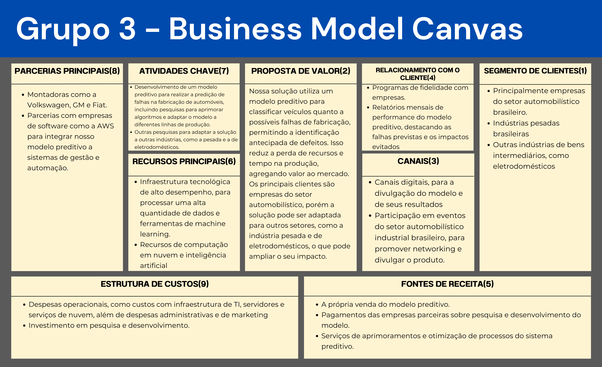

## Introdução

&emsp;O Business Model Canvas (BMC) é uma ferramenta de planejamento estratégico que permite visualizar e descrever os modelos de negócios de uma empresa em um único quadro. Ela se tornou um dos modelos mais utilizados por empreendedores, startups e empresas devido à sua metodologia simples e eficaz[1].

&emsp;O BMC é composto por nove blocos principais que representam os elementos de um modelo de negócios:

#### 1. Segmento de Clientes: quem são os clientes.
#### 2. Proposta de Valor: o que a empresa oferece ao mercado.
#### 3. Canais: como a empresa entrega sua proposta de valor.
#### 4. Relacionamento com o Cliente: o tipo de relação que a empresa estabelece com seus clientes.
#### 5. Fontes de Receita: como a empresa gera receita.
#### 6. Recursos Principais: os recursos necessários para oferecer a proposta de valor.
#### 7. Atividades Chave: as atividades mais importantes que a empresa deve realizar.
#### 8. Parcerias Principais: as parcerias externas que ajudam a empresa a funcionar.
#### 9. Estrutura de Custos: os custos envolvidos na operação do negócio[2].

&emsp;Além disso, esta ferramenta permite que as organizações avaliem rapidamente a viabilidade de uma ideia de negócios, identifiquem áreas de oportunidade e tomem decisões estratégicas com base em dados e informações. Dessa forma, o BMC pode ajudar a entender melhor como uma empresa cria, entrega e captura valor, e chegar na conclusão de que a ideia pode se sustentar ou não.

## Bussiness Model Canvas

&emsp;A partir destes princípios, foi desenvolvido um BMC sobre este projeto. Apesar de todo o contexto do projeto, em que o cliente é a Atvos e consiste num projeto de graduação na faculdade Inteli, este BMC foi criado como se uma empresa de startup estivesse vendendo este tipo de projeto. 

 

Fonte: Elaborado pelo grupo Käfer

&emsp;Vale destacar que o nove blocos foram enumerados numericamente. Isso foi feito para ajudar tanto na criação deste modelo de negócio quanto para o entendimento de todos os blocos. Ao seguir esta ordem numérica, é possível entender como funciona a relação com o cliente, desde segmentos de clientes até fontes de receita, e depois entender como colocar tudo em prática, desde recursos principais até estrutura de custos.

&emsp;Dessa maneira, é possível utilizar o BMC para agregar ao planejamento estratégico de um projeto, e também para buscar o entendimento de como o projeto pode entregar valor e ao mesmo tempo se sustentar no mercado.

## Bibliografia

[1] VOITTO. Desvende o Business Model Canvas e visualize, analise e inove no seu modelo de negócios!. Disponível em: https://www.voitto.com.br/blog/artigo/business-model-canvas.

[2] ANALISTA MODELO DE NEGOCIOS. O que é o Business Model Canvas. Disponível em: https://analistamodelosdenegocios.com.br/o-que-e-o-business-model-canvas/.