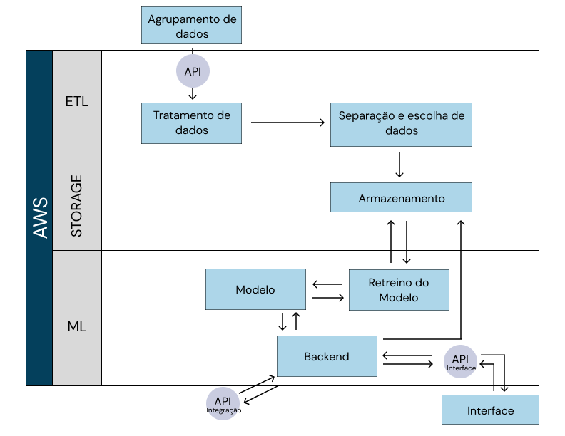

# Introdução

&emsp;&emsp;A seção de Requisitos Técnicos é fundamental para o sucesso de qualquer projeto, pois define as especificações necessárias para que o desenvolvimento ocorra de maneira eficiente e alinhada aos objetivos. Portanto, esta documentação tem como propósito detalhar os requisitos técnicos levantados, abordando aspectos cruciais como software, desempenho, e outras necessidades técnicas. Com esses requisitos bem definidos, garantimos que todos os envolvidos no projeto tenham uma compreensão clara das expectativas e das metas a serem alcançadas.

## Proposta Geral do Sistema 

&emsp;&emsp;Durante a apresentação dos representates da Volkswagen, parceiros desse projeto, foi apresentado a necessidade de inspeções mais assertivas antes do processo de rodagem dos veículos na fábrica montadora. Em resposta a essa demanda, foi proposto que os alunos desenvolvessem um projeto de modelo preditivo para classificar os carros com possíveis defeitos nas seguintes categorias: classe 1 e classe 2. O objetivo principal é tornar o processo de inspeção mais eficiente, concentrando-se nos problemas mais prováveis, o que permitirá economizar tempo e reduzir a ocorrência de problemas na fase de testes de rodagem.

&emsp;&emsp;Então, a solução, sendo um modelo preditivo - que, a desejo do parceiro, a acurácia deve ser acima de 95% - e de classificação, tem como objetivo melhorar a eficiência dos testes de rodagem, através da classificação e identificação prévia (durante a montagem) de possíveis defeitos. Além disso, a solução precisa ser projetada visando a escalabilidade do sistema, tendo como proposta calibrar mensalmente com novos dados de produção, visando, cada vez mais, a assertividade no tipo de inspeção que deve ser realizada em determinados veículos na rodagem.

&emsp;&emsp;O sistema será utilizado pelos analistas de sistemas da fábrica para ajustar o processo de inspeção e fornecer uma visualização clara dos resultados do algoritmo. Isso permitirá que o motorista inspetor saiba exatamente o tipo de inspeção necessária para cada veículo, garantindo uma abordagem mais eficaz e direcionada na fase de rodagem.

## Requisitos Funcionais

&emsp;&emsp;Requisitos funcionais são as funcionalidades específicas que o sistema deve proporcionar para executar as operações desejadas.

&emsp;&emsp;Para este projeto, foi elaborado os seguintes requisitos funcionais para atender às necessidades das personas identificadas e entregar o valor estipulado:

&emsp;&emsp;**RF1 - Interface Gráfica simples**
- A interface gráfica deve apresentar de forma clara e objetiva os resultados da classificação gerada pelo modelo preditivo, permitindo que o usuário final identifique facilmente o tipo de inspeção a ser realizada. Além disso, o sistema deve integrar um dashboard interativo para a visualização dos resultados do modelo e das métricas associadas.

&emsp;&emsp;**RF2 - Funcionalidade que permite importar dados**
- O sistema deve suportar a importação de dados a partir de diferentes fontes, como arquivos CSV, XLSX, bancos de dados SQL e APIs externas, permitindo também o ajuste e re-treinamento do modelo para melhorar a precisão com base em dados atualizados.

&emsp;&emsp;**RF3 - Utilização em Cloud**
- A aplicação deve ser migrada para a nuvem, utilizando a infraestrutura da AWS, com uma arquitetura em cloud capaz de armazenar o modelo preditivo previamente treinado e realizar o deploy da API do projeto.

&emsp;&emsp;**RF4 - Integração entre tecnologias**
- Deve ser estabelecida uma integração completa entre o modelo de predição, o banco de dados e o sistema de coleta de dados, permitindo um fluxo contínuo e eficiente de informações entre esses elementos.

&emsp;&emsp;**RF4 - Documentação**
- A documentação do projeto precisa explicar em detalhes como o sistema funciona, as técnicas empregadas no modelo preditivo, os processos de integração e o uso da interface de usuário, visando assegurar a compreensão e a manutenção apropriadas do projeto.

&emsp;&emsp;Esses requisitos funcionais cobrem as principais necessidades do projeto e garantem que o modelo preditivo seja eficaz e fácil de usar, atendendo às expectativas da fábrica.

## Requisitos Não Funcionais

&emsp;&emsp;Requisitos não funcionais são as características de qualidade essenciais para o sistema, garantindo que a solução atenda aos critérios de eficiência e eficácia, oferecendo uma base sólida para alcançar os requisitos funcionais com excelência.

&emsp;&emsp;Para este projeto, foi elaborado os seguintes requisitos não funcionais para atender às necessidades das personas identificadas e entregar o valor estipulado:

&emsp;&emsp;**RNF1 - Acurácia do Modelo**
- O modelo deve categorizar os carros corretamente nas duas classes, apresentando uma acurácia eficiente de 95% em relação às classificações das possíveis manutenções necessárias.

**Métrica associada** - a seguinte métrica foi definida para que o modelo funcione de forma apropriada:
- A precisão deve ser superior a 95% 
- O modelo deve ser amplamente testado e com base nos dados dos testes, definir se atende as expectativas do cliente.

&emsp;&emsp;**RNF2 - Usabilidade da Interface Gráfica**
- A interface gráfica deve ser projetada para ser fácil de usar e entender, permitindo que os operadores rapidamente compreendam a classe do defeito identificado e o tipo de inspeção que deve ser feita.

**Métrica associada**: A usabilidade da interface será avaliada pelo número de etapas (cliques) necessárias para concluir uma tarefa, limitado a no máximo 3 cliques. Além disso, espera-se que 90% das funcionalidades estejam disponíveis ou indicadas diretamente na tela inicial, facilitando o acesso às ferramentas necessárias.

&emsp;&emsp;Segurança não foi mencionado como um requisito do projeto dado que esse não é o foco do projeto. Apesar disso, é fortemente sugerido que seja desenvolvido um sistema de segurança para esse projeto dado que contém dados confidenciais.

## Estudo de Viabilidade Técnica

&emsp;&emsp;O estudo de viabilidade técnica é uma etapa crucial no desenvolvimento de projetos, especialmente em um contexto de inovação e aplicação de novas tecnologias. No caso do nosso projeto, que visa implementar um modelo preditivo para auxiliar na manutenção dos veículos da Volkswagen com base nos dados do processo de montagem, o estudo de viabilidade técnica desempenha um papel fundamental. Ele garante que as decisões tomadas ao longo do desenvolvimento sejam embasadas em dados reais e analises cuidadosas.

### Tecnologia e Ferramentas Disponíveis

- Modelos de Aprendizado de Máquina: São tecnologias bem estabelecidas e de amplo uso na industria que automatizam a análise de grandes volumes de dados, identificam padrões complexos, e melhoram com novos dados, resultando em previsões mais precisas e adaptáveis a diferentes aplicações.

- Serviço de Cloud: A adoção de um serviço de cloud é uma escolha técnica vantajosa para este projeto porque oferece escalabilidade, permitindo ajustar os recursos conforme a demanda, além de garantir alta disponibilidade e segurança. A nuvem facilita a integração com outras ferramentas e serviços, como APIs e bancos de dados, e suporta a implantação e o armazenamento de modelos preditivos, tudo com gerenciamento simplificado e custos otimizados.

- Interface (FastAPI e React): Uma interface desenvolvida com FastAPI e React é eficiente, combinando a velocidade e simplicidade de FastAPI para criar APIs robustas com a flexibilidade de React para construir interfaces interativas e dinâmicas, resultando em uma aplicação ágil, escalável e de fácil manutenção.

### Análise de dados

&emsp;&emsp;O parceiro forneceu uma ampla variedade de dados detalhando o processo de fabricação dos carros T-Cross. A grande quantidade de dados permitiu uma exploração e testes abrangentes. No entanto, observa-se que a maioria dos carros apresenta algum defeito em determinado momento do processo de montagem. Isso pode representar um desafio, pois há o risco de enviesar o modelo, resultando na identificação de falhas em todos os veículos, o que foge do objetivo do projeto.

<b> Figura 1 - Gráfico de Tipos de Falhas</b>

  
  
<b>Fonte:</b> Elaborado por Grupo 3

&emsp;&emsp;Foram realizadas diversas análises e estudos dos dados da Volkswagen para identificar a melhor forma de aproveitá-los. Com base nessas análises, decidiu-se unir as seguintes tabelas: Tabela de Predição de Falhas e Tabela de Resultados. Essas tabelas contêm informações como a identificação do modelo, o status da carroceria e a identificação do grupo de resultados. A partir dos dados das colunas ID, STATUS, UNIT e VALUE_ID, vamos prever a possibilidade de falhas. Para validar essas previsões, será utilizada a tabela com os resultados finais da montagem. Como os dados ainda precisam ser tratados, essas colunas não serão utilizadas no modelo final, mas sim, os dados que essas colunas contem.

&emsp;&emsp;Essas informações permitem desenvolver um modelo robusto, com dados suficientes para analisar o processo de montagem de forma abrangente, aumentando as chances de sucesso nas previsões. É importante destacar que os dados, inicialmente distribuídos em vários arquivos, precisaram ser reunidos em um único arquivo para viabilizar a análise. Durante esse processo, constatou-se que os dados mais impactantes para o modelo em desenvolvimento são aqueles relacionados ao torque no processo de montagem dos carros. Diante dessa constatação, o modelo deve se basear principalmente nessas informações.

As analises apresentadas nesse texto foram obtidas a apartir das informações obtidas nesse notebook:[ Notebook](https://github.com/Inteli-College/2024-2A-T08-EC07-G03/blob/main/notebooks/transform.ipynb)

## Diagrama de blocos

&emsp;&emsp;A arquitetura da solução desenvolvida é estruturada em três fases principais: ETL (Extração, Transformação e Carga), Storage e Aprendizado de Máquina (Machine Learning - ML). Todo o sistema é hospedado na nuvem, utilizando os serviços da AWS.

&emsp;&emsp;O processo inicia-se na fase de ETL, onde os dados são cuidadosamente tratados para otimizar o desempenho do modelo preditivo. Durante essa etapa, os dados também são separados em conjuntos de treino e teste, permitindo a validação eficaz do modelo com base em novos dados inseridos.

&emsp;&emsp;Seguindo para a próxima etapa, como o nome sugere, storage é o momento que ocorre o armazenamento dos dados inseridos juntamente com o retreino do modelo e o backend.

&emsp;&emsp;Na fase de aprendizado de máquina (ML), os dados de separados são submetidos ao processo de retreino do modelo, visando a atualização frequente de dados, possibilitando prever, precisamente, a ocorrência de falhas. Também, durante essa fase, os dados gerados pelo modelo são armazenados em uma nova tabela. Essa tabela alimenta o servidor backend, que, por sua vez, apresenta essas informações em uma interface interativa e intuitiva, facilitando a visualização e interpretação dos resultados.

<b> Figura 1 - Diagrama de Blocos</b>

  
  
<b>Fonte:</b> Elaborado por Grupo3

