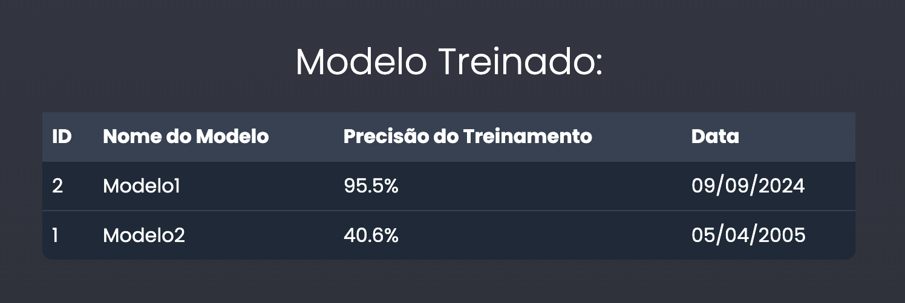

# Rotas Implementadas

Foram implementadas três novas rotas para interagir com o banco de dados Supabase:

### 1. Rota para Buscar Entradas de Dados

- **Endpoint:**

  ```python
  @router.get("/data-entries")
  async def data_entries_endpoint():
      return await get_data_entries()
  ```

- **Função:**

  ```python
  async def get_data_entries():
      response = supabase.table("data_entries").select("*").execute()
      data_entries = response.data
      return data_entries
  ```

- **Descrição:**
  Recupera todas as entradas de dados da tabela `data_entries` no Supabase. Essas entradas são utilizadas para alimentar os processos de análise e modelagem preditiva.

### 2. Rota para Buscar Resultados de Análises

- **Endpoint:**

  ```python
  @router.get("/analysis-results")
  async def analysis_results_endpoint():
      return await get_analysis_results()
  ```

- **Função:**

  ```python
  async def get_analysis_results():
      response = supabase.table("analysis_results").select("*").execute()
      analysis_results = response.data
      return analysis_results
  ```

- **Descrição:**
  Obtém todos os resultados das análises armazenadas na tabela `analysis_results` no Supabase, permitindo que os usuários acessem insights gerados pelo sistema de forma eficiente.

### 3. Rota para Buscar Histórico de Treinamentos de Modelos

- **Endpoint:**

  ```python
  @router.get("/model-training")
  async def model_training_endpoint():
      return await get_model_training()
  ```

- **Função:**

  ```python
  async def get_model_training():
      response = supabase.table("model_training").select("*").execute()
      model_training = response.data
      return model_training
  ```

- **Descrição:**
  Acessa os dados de treinamentos dos modelos preditivos a partir da tabela `model_training` no Supabase. Esta rota é utilizada para gerar uma tabela no front-end, proporcionando aos usuários uma visão geral dos modelos já treinados, incluindo informações como data de treinamento e métricas de desempenho. Isso permite que os usuários tenham uma visão mais geral sobre os modelos treinados, facilitando o acompanhamento e a comparação entre diferentes versões dos modelos.

# Estrutura e Organização

As rotas estão organizadas de forma modular dentro da pasta `routers`, separando a definição das rotas (`@router.get`) das funções de lógica de negócio (controllers). A comunicação com o Supabase é realizada de maneira assíncrona, garantindo eficiência e desempenho no backend.

# Integração com o Front-end

As rotas implementadas foram projetadas para facilitar a integração com o front-end da aplicação. Em particular, a rota `/model-training` é utilizada para popular uma tabela que exibe aos usuários uma visão geral dos modelos treinados. Essa tabela permite que os usuários visualizem rapidamente informações essenciais sobre cada modelo, como data de treinamento, métricas de desempenho e parâmetros utilizados, contribuindo para uma melhor compreensão e monitoramento dos modelos preditivos implementados.

# Resultado final



---
